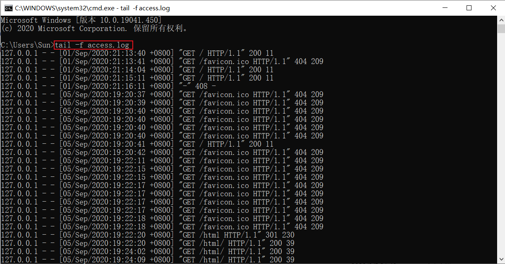

# Windows 版 tail 命令

## 环境

```
python3
库：均为自带标准库
```

## 用法

用法目前已经实现了基本功能：

```
python windows-tail.py log.txt #默认不带参数为一次性输出查看所有内容
python windows-tail.py -f log.txt # -f 参数表示为持续性输出新的日志内容
```

## CMD 命令行下用法

在 [Releases](https://github.com/Writeup001/windows-tail/releases) 中下载 tail.exe 可执行文件，将其复制到 Windows 电脑下的 `C:\Windows\System32` 目录，即可在 CMD 或 PowerShell 终端下执行了，用法与上述保持一致。

```
tail log.txt
tail -f log.txt
```




## Releases 生成

项目中 Releases 生成的可执行文件由 Python 的 [pyinstaller](https://pypi.org/project/pyinstaller/) 库进行打包生成。